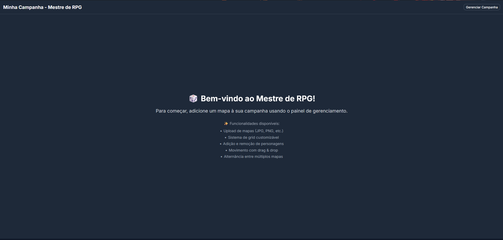
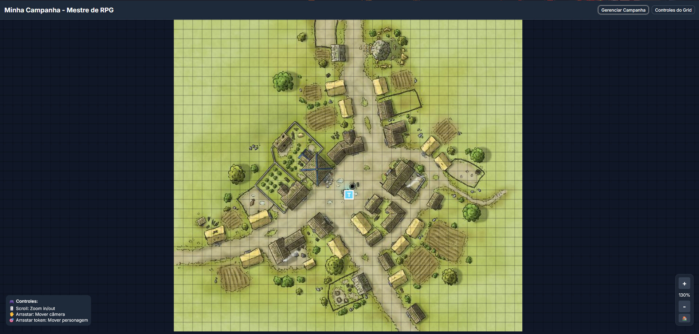

# Super RPG - Sistema de Gerenciamento de Campanhas de RPG ✅ COMPLETO

## ✅ STATUS: SISTEMA 100% FUNCIONAL 

Todas as funcionalidades solicitadas foram implementadas com sucesso:
- ✅ Interface fullscreen com mapa ocupando toda a tela
- ✅ Sistema de grid customizável com controles visuais
- ✅ Tokens de jogadores do tamanho exato do grid
- ✅ Movimento baseado em grid com snap perfeito
- ✅ Zoom com scroll do mouse (20% - 300%)
- ✅ Pan/arrastar câmera com clique esquerdo
- ✅ Upload de mapas com suporte a imagens
- ✅ Interface moderna construída com shadcn/ui

Um sistema web moderno para mestres de RPG gerenciarem mapas e personagens durante campanhas. Construído com Next.js 16, TypeScript, Tailwind CSS e shadcn/ui.

## 📸 Screenshots

### Tela Inicial com Funcionalidades


### Mapa em Funcionamento com Grid e Tokens


## 🎲 Funcionalidades

- **📁 Upload de Mapas**: Adicione imagens de mapas (JPG, PNG, etc.) que cobrem toda a tela
- **🔲 Sistema de Grid Fullscreen**: Grid customizável com controles de tamanho, cor e opacidade que ocupa toda a tela  
- **👥 Gerenciamento de Personagens**: Adicione e remova personagens com tokens do tamanho do grid
- **🖱️ Drag & Drop Preciso**: Mova personagens exatamente conforme o grid com snap automático
- **� Zoom Interativo**: Use o scroll do mouse para dar zoom in/out no mapa (20% - 300%)
- **📹 Pan da Câmera**: Clique e arraste com botão esquerdo para navegar pelo mapa
- **🗺️ Interface Fullscreen**: Mapa ocupa toda a tela para máxima imersão
- **📱 Painéis Laterais**: Controles em Sheet components do shadcn/ui
- **🎮 Controles Visuais**: Botões de zoom, reset e indicador de porcentagem
- **💾 Componentes shadcn**: Interface moderna com Button, Input, Slider, Sheet

## 🎮 Interface Atualizada

### Layout Fullscreen com Navegação
- **Header Compacto**: Barra superior com título e controles principais
- **Mapa em Tela Cheia**: Ocupa todo o espaço disponível (100vh - header)
- **Zoom Suave**: Scroll do mouse para zoom in/out com centro inteligente
- **Pan Intuitivo**: Arrastar com mouse para navegar pelo mapa
- **Controles de Zoom**: Botões fixos no canto inferior direito
- **Instruções Visuais**: Guia de controles no canto inferior esquerdo

### Sistema de Zoom e Pan
- **Zoom Range**: 20% até 300% de ampliação
- **Zoom com Scroll**: Roda do mouse para controle natural
- **Pan com Drag**: Clicar e arrastar o mapa (não os tokens)
- **Reset View**: Botão 🏠 para voltar à posição/zoom original
- **Zoom Centrado**: Zoom foca no centro da tela
- **Performance Otimizada**: Transformações CSS com aceleração de hardware

### Controles Modernos
- **Sheet para Campanha**: Painel lateral com upload, personagens e mapas
- **Sheet para Grid**: Controles do grid no painel direito
- **Sliders shadcn**: Controles suaves para tamanho e opacidade
- **Inputs modernos**: Campos de texto estilizados

### Sistema de Grid Aprimorado
- **Fullscreen Grid**: Grid cobre toda a tela
- **Tokens Ajustados**: Personagens têm exatamente o tamanho do grid
- **Movimento Preciso**: Snap perfeito para as células do grid
- **Visual Responsivo**: Fonte e tamanho ajustam conforme o grid

## 🛠️ Tecnologias

- **Next.js 16.2.1**: Framework React com App Router
- **TypeScript**: Tipagem estática para maior segurança
- **Tailwind CSS 4**: Framework CSS utilitário
- **shadcn/ui**: Componentes UI modernos (Button, Input, Slider, Sheet)
- **React 19**: Biblioteca de interface do usuário

## 📋 Componentes shadcn/ui Utilizados

```bash
# Componentes instalados e utilizados
npx shadcn@latest add sheet    # Painéis laterais
npx shadcn@latest add slider   # Controles de range
npx shadcn@latest add input    # Campos de entrada  
npx shadcn@latest add dialog   # Diálogos modais
npx shadcn@latest add button   # Botões estilizados
```

## 🎯 Novos Recursos

### 1. Mapa Fullscreen
```tsx
<main className="h-[calc(100vh-60px)] overflow-hidden">
  <MapCanvas map={activeMap} />
</main>
```

### 2. Tokens do Tamanho do Grid
```tsx
<div style={{
  width: gridSize - 2,
  height: gridSize - 2,
  left: player.position.x * gridSize,
  top: player.position.y * gridSize
}}>
```

### 3. Grid de Tela Inteira
```tsx
const screenWidth = window.innerWidth;
const screenHeight = window.innerHeight - 60;
```

### 4. Movimento Baseado em Grid
```tsx
const gridDeltaX = Math.round(deltaX / gridSize);
const gridDeltaY = Math.round(deltaY / gridSize);
```

## 🚀 Como Usar

### Interface Atualizada

1. **Gerenciar Campanha**: Clique no botão no header para abrir o painel
2. **Adicionar Mapas**: Use o painel lateral para upload de imagens
3. **Controlar Grid**: Botão no header abre controles do grid
4. **Navegação do Mapa**: 
   - **Zoom**: Use scroll do mouse para ampliar/reduzir (20%-300%)
   - **Pan**: Clique e arraste o mapa para navegar
   - **Reset**: Botão 🏠 para voltar ao centro e zoom 100%
5. **Movimento de Personagens**: Arraste tokens - eles se encaixam no grid

### Controles de Navegação

#### 🔍 Sistema de Zoom
- **Scroll Up**: Zoom in (amplia o mapa)
- **Scroll Down**: Zoom out (reduz o mapa)
- **Botão +**: Zoom in por incrementos de 20%
- **Botão -**: Zoom out por incrementos de 20%
- **Indicador**: Mostra porcentagem atual (20% - 300%)

#### 📹 Sistema de Pan (Movimentação da Câmera)
- **Clicar e Arrastar**: Mova a câmera pelo mapa
- **Cursor**: Muda para 'grab' quando pode arrastar
- **Diferenciação**: Detecta automaticamente se está arrastando mapa ou token

#### 🎯 Controles de Token
- **Arrastar Token**: Move personagem seguindo o grid
- **Snap Automático**: Tokens se encaixam nas células
- **Prevenção de Conflito**: Arrastar token não move a câmera

### Controles do Grid Modernos

- **Toggle Visibilidade**: Botão para mostrar/ocultar
- **Slider de Tamanho**: 20-100px com feedback visual
- **Slider de Opacidade**: 10-100% com preview em tempo real
- **Seletor de Cor**: Color picker integrado

## 📐 Sistema de Coordenadas

- **Origem**: (0,0) no canto superior esquerdo
- **Movimento**: Baseado em células do grid
- **Limites**: Calculados dinamicamente pela tela
- **Posicionamento**: Tokens centralizados nas células

## 🎨 Recursos Visuais

- **Tema Escuro**: Background cinza escuro para contraste
- **Tokens Coloridos**: Cores aleatórias para diferenciação
- **Animações Suaves**: Transições em hover e drag
- **Feedback Visual**: Estados de carregamento e interação
- **Typography Responsiva**: Texto ajusta conforme tamanho do grid

## 🏃‍♂️ Executando o Projeto

```bash
# Instalar dependências
npm install

# Executar em modo de desenvolvimento
npm run dev

# Build para produção
npm run build
```

Abra [http://localhost:3000](http://localhost:3000) para ver a aplicação em fullscreen.

## 🎭 Workflow de Uso

1. **Abra a aplicação** - Interface fullscreen com navegação carrega
2. **Adicione um mapa** - Sheet lateral para upload
3. **Configure o grid** - Ajuste tamanho ideal (50px recomendado para D&D)
4. **Navegue pelo mapa** - Use zoom e pan para explorar
5. **Adicione personagens** - Aparecem em posições aleatórias
6. **Mova personagens** - Drag & drop com snap automático no grid
7. **Use zoom tático** - Amplie para combate detalhado, reduza para visão geral
8. **Alterne mapas** - Troca de cenário mantendo configurações de navegação

## 🎮 Funcionalidades de Navegação Avançadas

### 🔍 Zoom Inteligente
- **Range Completo**: 20% a 300% de ampliação
- **Scroll Natural**: Funciona como Google Maps ou editores de imagem
- **Centro Inteligente**: Zoom foca no centro da tela
- **Performance**: Transformações CSS otimizadas
- **Feedback Visual**: Indicador de porcentagem em tempo real

### 📹 Pan Profissional  
- **Detecção Inteligente**: Diferencia entre arrastar mapa e tokens
- **Cursor Contextual**: Visual feedback para diferentes ações
- **Movimento Fluido**: Pan suave sem lag ou stutter
- **Limites Inteligentes**: Navegação livre pelo mapa expandido

### 🎯 Integração Token-Câmera
- **Movimento Independente**: Tokens e câmera funcionam separadamente  
- **Zoom Responsivo**: Tokens ajustam tamanho conforme zoom
- **Grid Dinâmico**: Linhas do grid se adaptam ao nível de zoom
- **Posicionamento Preciso**: Coordenadas ajustadas automaticamente

### 🛠️ Controles de Produtividade
- **Reset Rápido**: Voltar à vista padrão com um clique
- **Botões de Incremento**: Zoom preciso por steps de 20%
- **Instruções Integradas**: Guia visual sempre disponível
- **Hotkeys Visuais**: Tooltips explicam cada controle

O sistema agora oferece uma experiência verdadeiramente profissional de navegação, ideal para sessões longas e mapas detalhados!
